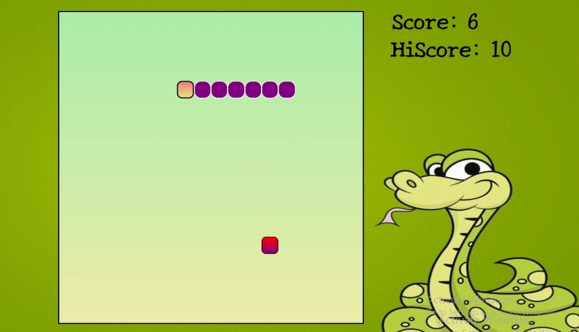

# Snake Game

## Description

This is a Snake Game developed using HTML, CSS and JavaScript. The project allows players to control a snake, collect food to increase the score and avoid collisions with the walls and the snake's own body. The game also keeps track of the highest score using the browser's local storage and includes sound effects and background music for a better gaming experience.

---

## Features

- Control the snake using arrow keys
- Collect food to increase the score
- High score saved using Local Storage
- Collision detection
- Game Over when the snake hits the wall or itself
- Sound effects and background music
- Simple and interactive game interface

---

## Technologies Used

- HTML5
- CSS3
- JavaScript

---

## Screenshot

### Snake Game

---

## Project Demo

Watch the project demo here:

[▶ Snake Game Demo](Demo/Snake-Game-Demo-Video.mp4)

---

## How to Run

1. Download or clone the repository.
2. Open the project folder.
3. Open the `index.html` file in your web browser.
4. Press any arrow key to start the game.
5. Collect food and avoid hitting the walls or the snake's body.

---

## Author

**Muhammad Talha**

Computer Science Student

---

## Thank You

Thank you for visiting this repository. I hope you find this project helpful.
